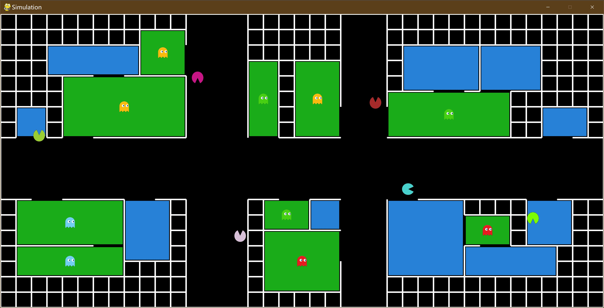
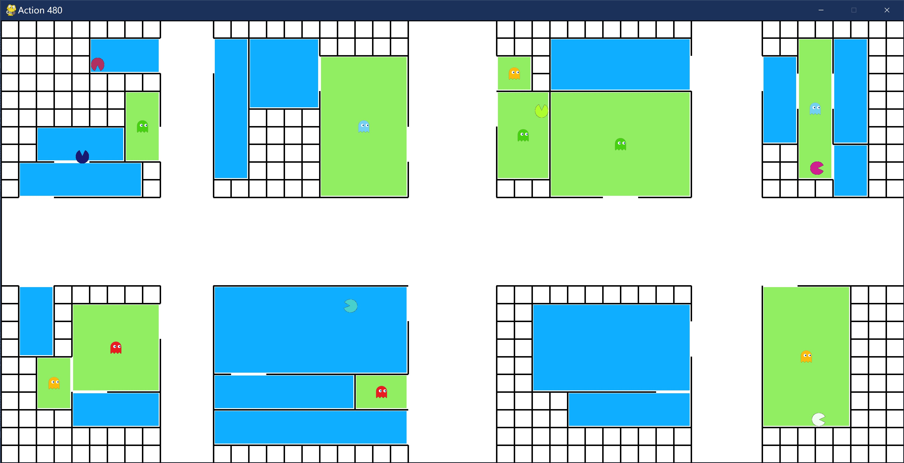

# Swarm Search Simulation - A simulation environment for the project "OA-Bug: An Olfactory-Auditory Augmented Bug Algorithm for Swarm Robots in a Denied Environment"





## How to play

1. Clone the repository.

2. Make sure Python 3.6+ is installed.

3. Make sure the environment meets the requirements.

   Execute the following command to install requirements.

   ```shell
   pip install -r requirements.txt
   ```

3. Run `runner.py`.

## Explanations

1. **Site Generator**

   The Site Generator is implemented to generate a reasonable site randomly. The width and height of the site, the number of rooms and victims are parameters that can be passed to the generator for each generation, which enables us to perform large-scale tests easily and to analyze the relationship between different configurations of site and the statistic results.

2. **Layout Class**

   The Layout Class creates objects according to the site generated by the generator or by hand. If graphics mode is enabled, it also draws the layout on the screen using the `PyGame` library.

3. **Robot Classes**

   The Robot Classes contain different robot objects implemented in different algorithms. If graphics mode is enabled, robots will be drawn on the screen. Note that although the robot must know its absolute position so that it can be drawn on the screen, in order to obey the scenario setup of this project, it never builds a map or uses its position to decide its next action.

4. **Robot Manager, Runner, and Utilities**

   They are classes that only serve for maintainability and scalability of the code. They can be modified at your wish. For example, one can toggle night mode, change scaling factor of the graphics and so on in `config.py`. We didn't use `argparse` for simplicity, but it can be easily adopted.

## Issues

If you find any bugs, misuse of words, bad grammar or need further explanations, please feel free to post issues and we will fix them when we are available to do so.

## Educational Uses

Feel free to use, as long as credits are made to this project :)

