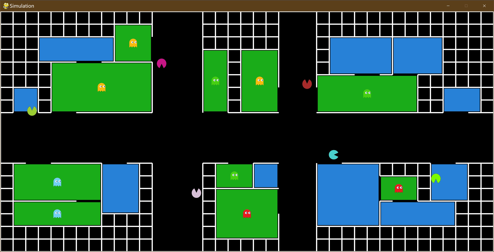
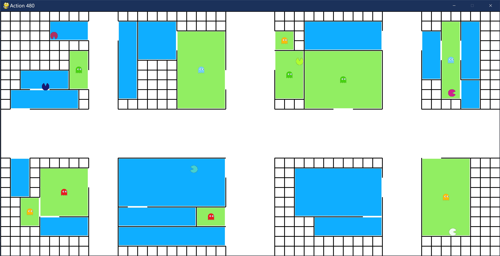

# Swarm Search Simulation - A simulation environment for the project "OA-Bug: An Olfactory-Auditory Augmented Bug Algorithm for Swarm Robots in a Denied Environment"





## How to play

1. Clone the repository.

2. Make sure Python 3.8+ is installed. (The most recent 3.11 is recommended due to its great performance improvement.)

3. Make sure the environment meets the requirements.

   Execute the following command to install requirements.

   ```shell
   pip install -r requirements.txt
   ```

4. Run `runner.py`. Press the `SPCAE` key to pause. The window will be scaled according to the scaling factor of your current monitor. If the window is too large, you can change the `SCALING_FACTOR` in `config.py`, or modify the parameters of the `SiteGenerator` in `runner.py`. Typical configurations are as follows:

   ```python
   SiteGenerator(width=40, height=20, num_rooms=30)  # Small, max SCALING_FACTOR = 3 using a 4K monitor
   SiteGenerator(width=60, height=30, num_rooms=40)  # Medium, max SCALING_FACTOR = 2 using a 4K monitor
   SiteGenerator(width=120, height=60, num_rooms=120)  # Large, max SCALING_FACTOR = 1 using a 4K monitor
   ```

## Explanations

1. **Site Generator**

   The Site Generator is implemented to generate a reasonable site randomly. The width and height of the site, the number of rooms and victims are parameters that can be passed to the generator for each generation, which enables us to perform large-scale tests easily and to analyze the relationship between different configurations of site and the statistic results.

2. **Layout Class**

   The Layout Class creates objects according to the site generated by the generator or by hand. If graphics mode is enabled, it also draws the layout on the screen using the `PyGame` library.

3. **Robot Classes**

   The Robot Classes contain different robot objects implemented in different algorithms. If graphics mode is enabled, robots will be drawn on the screen. Note that although the robot must know its absolute position so that it can be drawn on the screen, in order to obey the scenario setup of this project, it never builds a map or uses its position to decide its next action.

4. **Robot Manager, Runner, and Utilities**

   They are classes that only serve for maintainability and scalability of the code. They can be modified at your wish. For example, one can toggle night mode, set whether to pause at the beginning for diagnostic purposes and so on in `config.py`. We didn't use `argparse` for simplicity, but it can be easily adopted.

## Notes

If you find any bugs, misuse of words, bad grammar or need further explanations, please feel free to post issues, and we will fix them when we are available to do so.

If you use the latest CPUs which are fast and have many cores, you may experience "database is locked" when using SQLite3 in the `StatisticRunner` to log the data because SQLite has a limited concurrent functionality. In this case, you can use MySQL instead.

## Educational Uses

Feel free to use, as long as credits are made to this project :)

